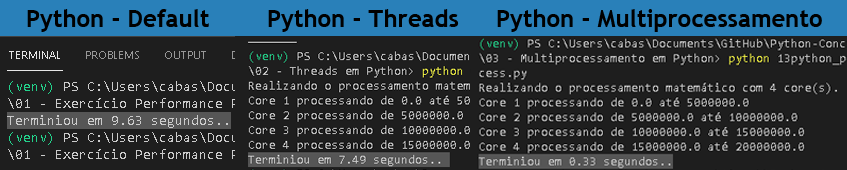

# Python-Conconrrente-Assincrono
  
Python ao extremo com Threads, Multiprocessamento, AsyncIO e Cython

## Performance
Usando uma função chamada computar para testar o processamento de cálculos matemáticos

e aqui o resultado:

Com multiprocessamento, sem o bloqueio do GIL, obtemos uma performance absurda em relação aos outros casos.

## Asyncio e sua Aplicabilidade
o Asyncio não se mostrou eficiente no teste de perfomance anterior, justamente porque não foi desenhado pra isso.
Ele é muito mais interessante em casos de Input/Output, Segue alguns exemplos:

* Donwload/Upload de Arquivos
* Requests: Como por exemplo a lib aioHTTP
* Escrita e leitura de arquivos em disco

## Cython
Se mostrou tão eficaz no processamento de dados quanto o multiprocessamento, mesmo utilizando um único Core. Apesar de não ser tão simples pode ser usado para extrema perfomance em Python.
